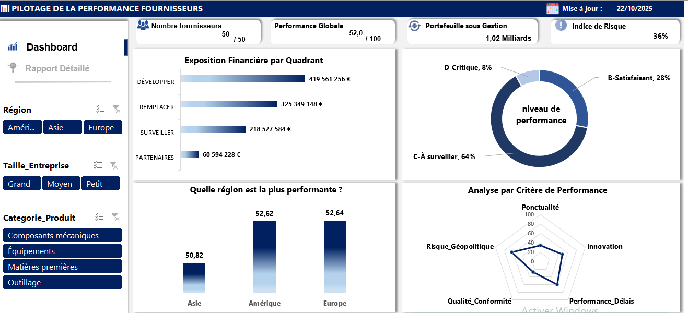
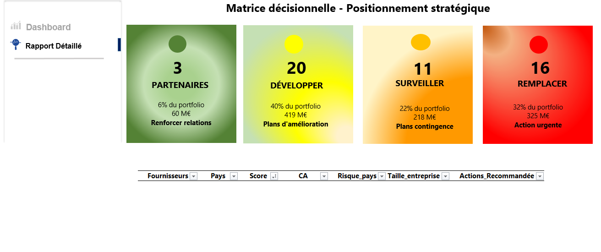

# Pilotage Stratégique d'un Portefeuille Fournisseurs (Excel, Power Query & VBA)

Ce projet est un outil complet d'aide à la décision pour la direction des achats, construit entièrement sur Excel. Il automatise l'évaluation des fournisseurs et fournit des visualisations interactives pour maîtriser les risques et la performance.

---

### Aperçu du Tableau de Bord Exécutif
L'outil principal est un dashboard dynamique qui donne une vision à 360° du portefeuille.

---

### 1. Problématique Business

L'objectif était de répondre à un besoin critique pour toute entreprise :
**"Comment évaluer objectivement nos fournisseurs pour réduire les risques de la chaîne d'approvisionnement et optimiser les coûts ?"**

Ce projet transforme une gestion subjective en un pilotage proactif basé sur des données factuelles.

---

### 2. La Solution : Un Outil Complet

La solution est un classeur Excel (`.xlsm`) qui intègre plusieurs technologies :

* **Tableau de Bord Exécutif :** Une vue synthétique (KPIs, graphiques interactifs) pour un diagnostic en 60 secondes.
* **Rapport Détaillé Dynamique :** Une interface interactive en VBA permettant d'explorer chaque segment de fournisseur en un clic.
* **Base de Données Centralisée :** Un modèle de données robuste qui consolide 3 sources de données hétérogènes.

---

### 3. Compétences et Méthodologie

Ce projet démontre la maîtrise de la chaîne de valeur analytique sur Excel :

**Étape 1 : ETL & Préparation des Données (Power Query)**
* Connexion et extraction des 3 sources de données brutes (`Data/`).
* Nettoyage et fusion des données (jointures) pour créer une table maîtresse unique (`T_Fournisseurs`).

**Étape 2 : Modélisation & Enrichissement**
* Implémentation du modèle de scoring (scores pondérés).
* Création de colonnes calculées (Score Numérique de Risque, Quadrant Stratégique) pour ajouter du contexte métier.

**Étape 3 : Analyse & Calculs (Tableaux Croisés Dynamiques)**
* Création de TCDs multiples servant de "moteur" pour tous les graphiques.
* Utilisation de formules avancées (`LIREDONNEESTABCROISDYNAMIQUE`) pour alimenter des graphiques non-standards (comme le Radar).

**Étape 4 : Visualisation & Interactivité (Dashboard)**
* Conception d'un dashboard centré utilisateur avec des filtres (Segments) connectés à l'ensemble des TCDs.

**Étape 5 : Automatisation & UX (VBA)**
* Développement d'un rapport détaillé dynamique sur une seule page.
* Utilisation de macros VBA pour contrôler la visibilité des objets et l'affichage des données (via une cellule de contrôle et des formules `INDEX/AGREGAT`).

---

### 4. Fichiers du Projet

* **`Livrables/`** : Contient le projet final.
    * `Tableau_de_Bord_Fournisseurs.xlsm` : Le fichier Excel principal (macros à activer).
    * `Documentation_Projet.pdf` : La documentation technique complète.
    * `Presentation_Resultats.pptx` : La présentation PowerPoint destinée au management.
* **`Data/`** : Contient les 3 fichier CSV bruts utilisés pour alimenter le projet.
* **`demo_images/`** : Contient les captures d'écran pour ce README.

---

### 5. Contact

Je suis toujours à la recherche de nouveaux défis pour transformer les données en décisions.

* **LinkedIn :** https://www.linkedin.com/in/brandon-gbalou
* **Email :** brandongbalou07@gmail.com
